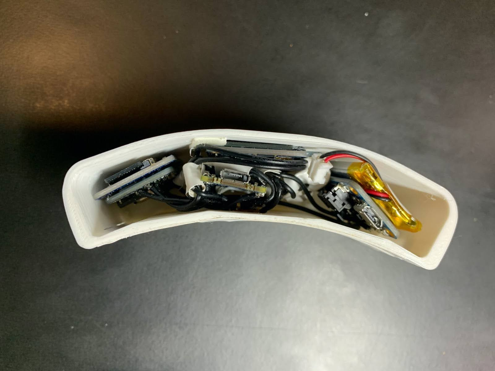
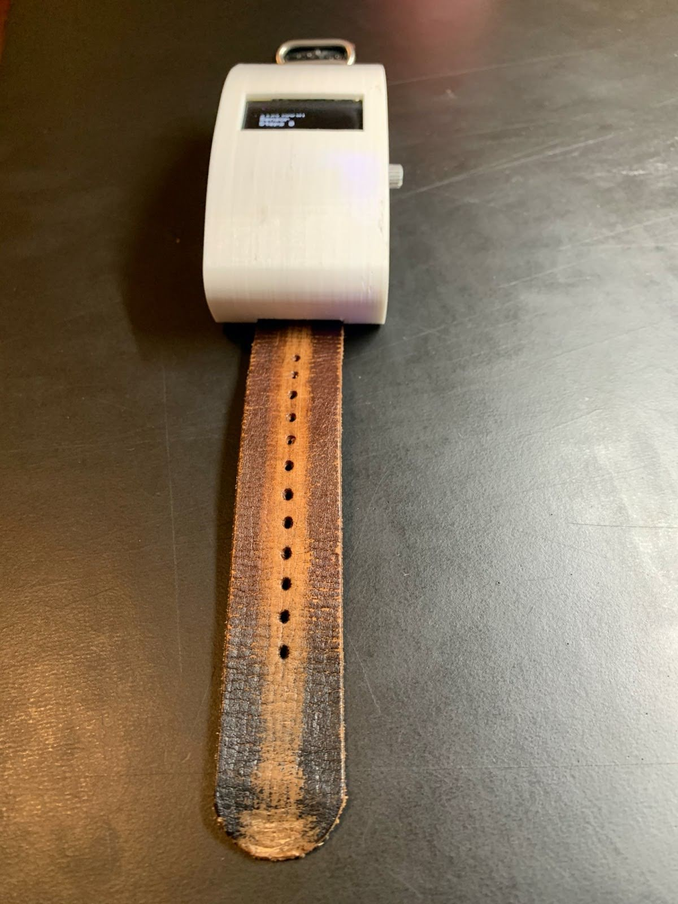
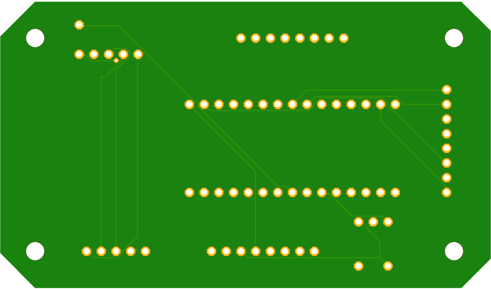

# Pulse Fitness Tracker

Welcome to the **Pulse Fitness Tracker** repository. This project is a wearable prototype that monitors heart rate, blood-oxygen levels, step count, and time of day, with integrated data logging and an interactive user interface.

---

## Table of Contents

1. [Project Overview](#project-overview)  
2. [Product Images & Demo](#product-images--demo)  
3. [Hardware Design](#hardware-design)  
4. [Software Architecture](#software-architecture)  
5. [Enclosure and PCB](#enclosure-and-pcb)  
6. [Regulatory Considerations](#regulatory-considerations)  
7. [Design Alternatives](#design-alternatives)  
8. [Deployment](#deployment)  
9. [Future Work](#future-work)  
10. [References](#references)

---

## 1. Project Overview

The **Pulse Fitness Tracker** is inspired by commercial fitness wearables (e.g., Apple Watch, Fitbit). Our objective was to create a low-cost, Arduino-based, open-source device with the following features:

- **Heart Rate & Blood-Oxygen Monitoring** using the SparkFun SEN-15219 sensor.
- **Step Tracking** using the onboard accelerometer/gyroscope of the Arduino Nano 33 BLE Sense.
- **Data Logging** via an SD card module for offline data storage.
- **Bluetooth Connectivity** to sync data with a React-based web application.
- **OLED Display & Rotary Encoder** for intuitive menu navigation and user interaction.
- **3D-Printed Enclosure** to house components, provide impact resistance, and partial water-resistance.
- **AWS Amplify Hosting** for easy web application deployment.

---

## 2. Product Images & Demo

### Product Images

- **Front View**  
  

- **Back View**  
  

- **Side View & Sensor**  
  

  - **Wrist Band View**  
  

## Demo Video

- **Pulse Watch Demo**  
  [Watch Demo Video](./media/pulse_watch_demo.mp4)

- **Pulse Web Demo**  
  [Watch Demo Video](./media/pulse_web_demo.mp4)


---

## 3. Hardware Design


### 3.1 Arduino Nano 33 BLE Sense
- **nRF52840 ARM-based microcontroller** with onboard Bluetooth, accelerometer, and gyroscope.
- Operates at **3.3V logic**, powering all other modules.
- Responsible for sensor data acquisition, BLE communication, and menu logic.

### 3.2 Power Supply
- **400 mAh LiPo Battery** connected to an **Adafruit PowerBoost 500c** for regulated 5V output.
- Charges via mini-USB without interrupting device operation.

### 3.3 Heart Rate & Oximetry Sensor
- **SparkFun SEN-15219** using Maxim Integrated’s MAX30101 (optical sensor) + MAX32664 (algorithmic hub).
- Communicates via **I2C** and outputs heart rate plus SpO2 readings in real time.

### 3.4 SD Card Storage
- **Adafruit 254 MicroSD Breakout** (SPI interface).
- Logs time-stamped sensor data for offline analysis.

### 3.5 OLED Display
- **1.3" monochrome OLED** (Adafruit 938).
- High contrast, low power usage, and **I2C** interface.

### 3.6 Rotary Encoder
- Primary input device for scrolling and selection (push-button).
- Used to toggle Bluetooth, start/stop data logging, and navigate menus.

---

## 4. Software Architecture

```
[ React Frontend ] <---> [ AWS GraphQL + DynamoDB ] <---> [ Arduino Device ]
       ^                                          ^
       |-------------- BLE ------------------------|
```

### 4.1 Frontend (React + Material-UI)


- Built with **ReactJS** for modular, reusable UI components.
- **Material-UI** provides a clean, responsive look.
- **MVC-like Pattern**:
  - **View:** Manages UI rendering (login, dashboard, charts, device pairing).
  - **Controller:** Handles user actions, routes data requests, manages BLE connectivity.
  - **Model:** Stores session info (user/device data) to minimize backend queries.

### 4.2 Backend (AWS GraphQL + DynamoDB)
- **AWS Amplify** integrates a GraphQL API for the web app.
- **DynamoDB** for NoSQL data storage of user info, sensor data, and analytics.
- **AWS Cognito** handles secure user authentication (signup/login).

### 4.3 Arduino Firmware
- Written in C++ for **Arduino Nano 33 BLE Sense**.
- Initializes sensors, reads/validates HR & SpO2 data, implements step-counting algorithms.
- Logs reliable data to the SD card; exposes BLE services for the web app.

---

## 5. Enclosure and PCB

### 5.1 Enclosure

- **3D-printed PLA** with ~35% honeycomb infill for shock absorption.
- Ports sealed with custom-printed plugs; coated with silicone spray for moisture resistance.
- Oversized enclosure due to modular components; can be worn on wrist or upper arm.

### 5.2 PCB



- **2-layer testing board** used to simplify wiring and debugging.
- Future iterations aim to integrate sensors and microcontroller on a single, compact PCB.

---

## 6. Regulatory Considerations

- **CCPSA (Canada Consumer Product Safety Act)**: Ensures proper labeling and safe manufacturing.
- **PIPEDA (Privacy)**: Protects user data from unauthorized access or distribution.
- **ISED**: Approvals required for electronic devices in Canadian markets.
- **ISO 10377**: Guidelines for product safety and risk management.
- **ISO/IEC JTC 1/SC 25**: Standardizing microprocessor interfaces and protocols.

---

## 7. Design Alternatives

1. **Board Choice**  
   - Considered Raspberry Pi vs. Arduino; chose Arduino Nano 33 BLE Sense for size, BLE integration, and low power.

2. **Display Technology**  
   - Chose **OLED** over LCD for better contrast and lower power consumption.

3. **Input Device**  
   - Selected rotary encoder over simple pushbuttons for intuitive scrolling + selection.

4. **Database**  
   - Opted for **NoSQL (DynamoDB)** since we only needed fast reads/writes and simple data structures.

---

## 8. Deployment


### Local Development
1. **Clone** the repository:

2. **Install dependencies** (frontend example):
   ```bash
   cd Pulse-Fitness-Tracker/pulse_frontend
   npm install
   # or
   yarn install
   ```
3. **Run the dev server**:
   ```bash
   npm start
   # or
   yarn start
   ```
4. Visit `http://localhost:3000` to view in your browser.


---

## 9. Future Work

1. **Miniaturization**  
   - Develop a custom PCB integrating microcontroller, power, and sensors on a single board.

2. **Enhanced Wearable Features**  
   - Activity recognition for rest/walk/run, calorie estimation, alarms.

3. **Social Integration**  
   - Allow user-to-user comparisons and challenges through the web or watch UI.

4. **Extended Rotary Encoder Menus**  
   - Access workout history, notifications, daily goals, etc.

5. **Battery Optimization**  
   - Improve sleep modes, sensor polling intervals, and data batching to reduce power draw.

---

## 10. References

1. [SparkFun SEN-15219 Documentation](https://www.sparkfun.com/products/15219)  
2. [Adafruit PowerBoost 500c](https://www.adafruit.com/product/1944)  
3. [Arduino Nano 33 BLE Sense Docs](https://docs.arduino.cc/)  
4. [AWS Amplify & DynamoDB](https://aws.amazon.com/)  
5. [Adafruit 254 MicroSD Breakout](https://www.adafruit.com/product/254)

---

**Thank you for exploring the Pulse Fitness Tracker!**
For feedback, questions, or contributions, open an issue or submit a pull request. We welcome any ideas that help us move closer to a production-ready, miniaturized wearable device.
