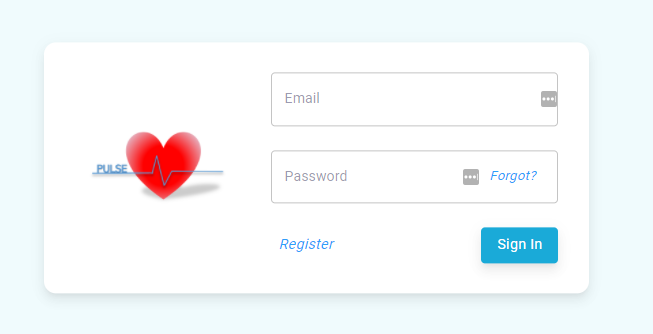
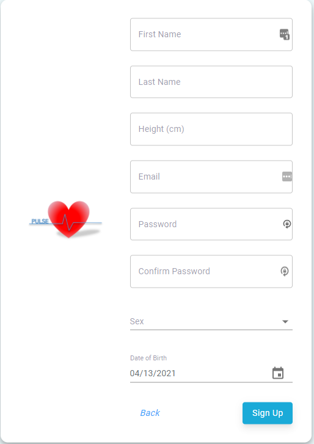
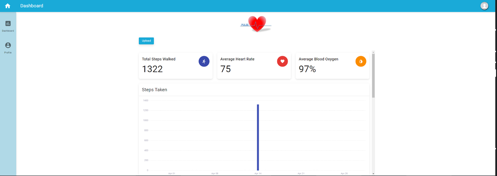
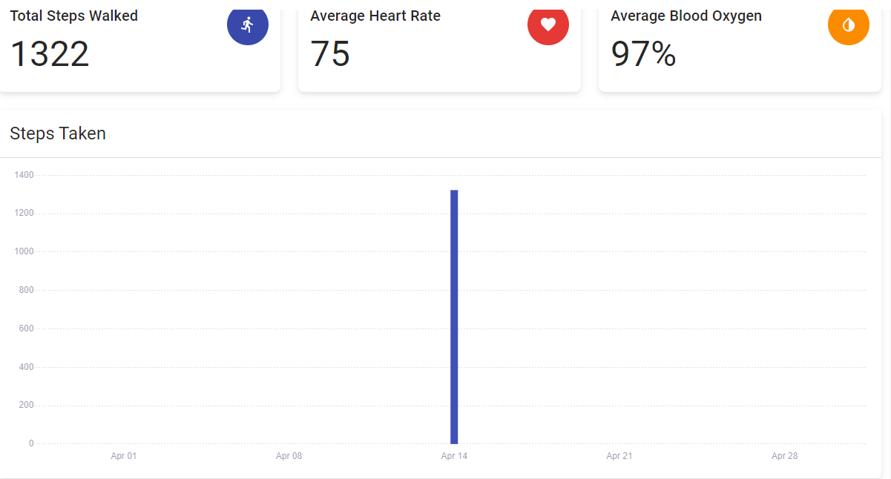
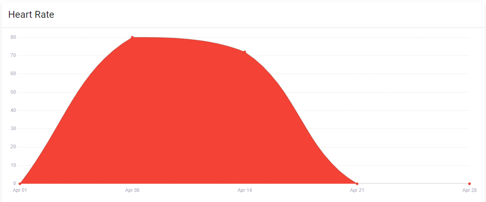
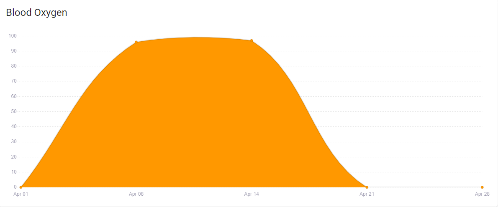

# Fitness Tracking System - Frontend

Welcome to the **Pulse Fitness Tracker Frontend**! This repository contains the source code for the web-based interface of the Pulse Fitness Tracker. Built using **ReactJS** and **Material-UI**, it provides an interactive and user-friendly platform to display and manage fitness data collected from wearable devices.

---

## Table of Contents

1. [Overview](#overview)
2. [Features](#features)
3. [Tech Stack](#tech-stack)
4. [Code Structure](#code-structure)
5. [Setup Instructions](#setup-instructions)
6. [Usage](#usage)
7. [Data Flow: BLE and GraphQL](#data-flow-ble-and-graphql)
8. [Future Improvements](#future-improvements)
9. [Contributing](#contributing)

---

## Overview

The frontend is designed to interface seamlessly with the Pulse Fitness Tracker device and backend services. It employs a **component-based architecture** to ensure modularity and reusability. The application connects to the device via **Bluetooth** and communicates with the backend for data storage and analytics.

---

## Features

1. **User Authentication**:
   - Login and account management with secure authentication.

### Login Page


### Registration Page


2. **Dashboard**:
   - Displays fitness metrics, including:
     - Heart rate
     - Blood oxygen level
     - Step count (graphed over time)

### Main Dashboard


### Dashboard Plot


### Heart Rate Plot


### Blood Oxygen Plot


3. **Device Pairing**:
   - Connect to the Pulse Fitness Tracker via Bluetooth.

4. **Data Management**:
   - Logs and visualizes user metrics.
   - Syncs data with the backend (AWS GraphQL + DynamoDB).

5. **Responsive Design**:
   - Built with Material-UI for a modern and aesthetically pleasing interface.

---

## Tech Stack

- **Frontend**: ReactJS
- **UI Framework**: Material-UI
- **State Management**: Context API
- **Backend Communication**: AWS GraphQL

---


### Key Modules

#### 1. **View Package**

The view package is responsible for rendering UI elements and ensuring data is presented to the user:

- **Login View**:
  - Accepts username and password input.
  - Passes credentials to the controller for authentication.
- **Dashboard View**:
  - Displays graphs and metrics (heart rate, blood oxygen, step count).
  - Provides access to the device pairing feature.
- **Device Pairing View**:
  - Allows users to connect to the Pulse Fitness Tracker via Bluetooth.

#### 2. **Controller Package**

Handles all application business logic:

- **App Controller**:
  - Manages login, Bluetooth communication, and backend interactions.
- **Login Controller**:
  - Authenticates user credentials with the backend.
- **Bluetooth Controller**:
  - Establishes communication with the tracker using UUIDs for services and characteristics.
- **DB Manager**:
  - Interfaces with the backend for data retrieval and updates.

#### 3. **Model Package**

Stores persistent data within the application:

- **User Entity**:
  - Tracks user information (e.g., name, age, height, unique ID).
- **Bluetooth Entity**:
  - Manages information about connected devices.

---

## Setup Instructions

### Prerequisites

- Node.js (v14 or later)
- npm

### Installation

### How to Run

1. **Install dependencies**:
   ```bash
   npm install --force
   ```

2. **Start the development server**:
   ```bash
   npm start
   ```

3. Open [http://localhost:3000](http://localhost:3000) in your browser.

---

## Usage

### Key Features

- **Login**:
  - Enter your username and password to access the dashboard.
- **Dashboard**:
  - View fitness metrics as graphs.
  - Pair your device to sync data.
- **Device Pairing**:
  - Enable Bluetooth on your computer.
  - Connect to the Pulse Fitness Tracker by selecting it from the list of available devices.

---

## Data Flow: BLE and GraphQL

### 1. Receiving Data via BLE
The **BluetoothController** in the frontend receives raw data from the Pulse Fitness Tracker:
- Connects to the device using UUIDs for services and characteristics.
- Reads heart rate, blood oxygen, step count, and timestamps as BLE characteristics.
- Structures this data into JSON for further processing:
  ```json
  {
    "heart_rate": 72,
    "blood_oxygen": 98,
    "step_count": 4567,
    "timestamp": "2025-01-15T12:00:00Z"
  }
  ```

### 2. Storing Data in NoSQL Database
The **frontend** communicates with the backend (AWS AppSync/GraphQL API) to store the data in DynamoDB:

1. **Storing Metric Data**:
   - Each metric (e.g., heart rate, step count) is stored using the relevant `create` mutation:
     ```javascript
     const heartRateData = {
       input: {
         heart_rate: 72,
         metrics: "collected during workout",
       },
     };
     API.graphql(graphqlOperation(createHeartRate, heartRateData));
     ```

   - Similarly, step count and blood oxygen data are stored using `createStepCount` and `createBloodOxygen` mutations.

2. **Linking Metrics to Analytics**:
   - After storing individual metrics, their `IDs` are used to create an `Analytics` entry:
     ```javascript
     const analyticsData = {
       input: {
         userID: "user123",
         date_recorded: "2025-01-15T12:00:00Z",
         stepCountID: "stepCount456",
         heartRateID: "heartRate789",
         bloodOxygenID: "bloodOxygen012",
       },
     };
     API.graphql(graphqlOperation(createAnalytics, analyticsData));
     ```

3. **Updating User Records**:
   - The `Analytics` entry is linked to the user profile:
     ```javascript
     const userData = {
       input: {
         id: "user123",
         analytics: { items: ["analytics123"] },
       },
     };
     API.graphql(graphqlOperation(updateUser, userData));
     ```

### 3. Querying Data
The provided GraphQL queries allow retrieving data efficiently. Here’s how to use them:

1. **Get User Data**:
   - Retrieve a user’s profile, including their analytics:
     ```graphql
     query GetUser($id: ID!) {
       getUser(id: $id) {
         id
         email
         first_name
         analytics {
           items {
             id
             date_recorded
             stepCountID
             heartRateID
             bloodOxygenID
           }
         }
       }
     }
     ```

2. **Get Analytics Data**:
   - Fetch details for a specific `Analytics` entry:
     ```graphql
     query GetAnalytics($id: ID!) {
       getAnalytics(id: $id) {
         date_recorded
         stepCount {
           step_count
         }
         heartRate {
           heart_rate
         }
         bloodOxygen {
           blood_oxygen
         }
       }
     }
     ```

3. **Query by Email**:
   - Find users by email and include their analytics (useful for login workflows):
     ```graphql
     query UserByEmail($email: String!) {
       userByEmail(email: $email) {
         items {
           id
           email
           analytics {
             nextToken
           }
         }
       }
     }
     ```

4. **Paginated List Queries**:
   - Fetch paginated results for analytics, step counts, heart rates, or blood oxygen data:
     ```graphql
     query ListAnalyticss($limit: Int, $nextToken: String) {
       listAnalyticss(limit: $limit, nextToken: $nextToken) {
         items {
           id
           date_recorded
           stepCount {
             step_count
           }
           heartRate {
             heart_rate
           }
           bloodOxygen {
             blood_oxygen
           }
         }
         nextToken
       }
     }
     ```

---

## Future Improvements

- Add multi-language support for a global user base.
- Expand Bluetooth functionality to auto-connect with previously paired devices.
- Optimize data visualization for improved performance on large datasets.
- Include user settings for customizing the dashboard layout.

---


Thank you for contributing to the Pulse Fitness Tracker Frontend! Feel free to reach out with any questions or suggestions.
